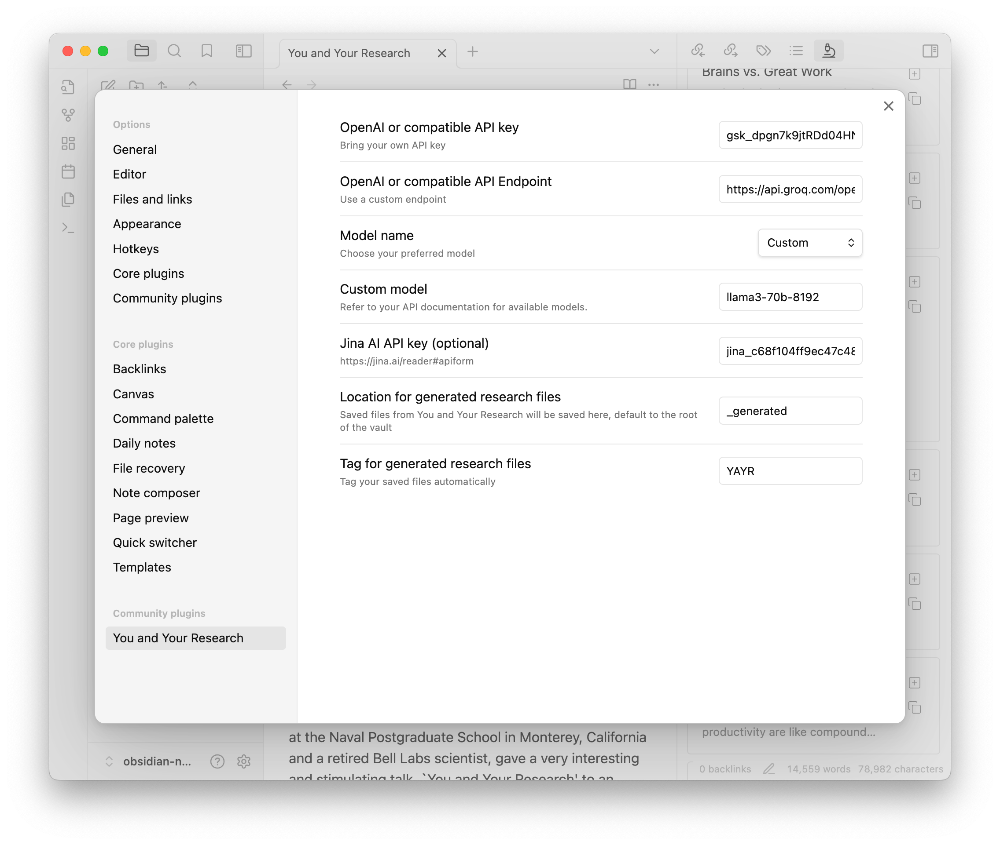

# You and Your Search

Research is an essential task performed by 1 billion knowledge workers. Many people also do research in their daily lives, such as travel planning.

Research requires intensive information retrieval, usually from long-form materials. This requires focus and attention. However, the current toolset for researchers usually requires them switch among many contexts: search engines, AI chats, file explorers, etc. This is very inefficient. Consolidating these tools into a single, integrated interface, like Obsidian, can greatly improve research efficiency. This allows for seamless transitions between tasks without disrupting focus, creating a flow just for You and Your Research.

The name of the plugin was obviously inspired by the infamous speech by Dr. Richard W. Hamming in 1986. You can retrieve the text at https://www.cs.virginia.edu/~robins/YouAndYourResearch.html.

## Get Started

Install and enable the plugin from Obsidian's Community Plugins platform.

### Setup

**REQUIRED** You will need to bring your own API key for using OpenAI. You can get it from the [OpenAI Dashboard](https://platform.openai.com/account/api-keys). Add it in the plugin settings.

You can choose gpt-3.5-turbo or gpt-4o as your model of choice.

**OPTIONAL** The plugin also uses Jina AI to extract the content of the web pages you read. You can also bring your own API key for using Jina AI. You can get it from the [Jina website](https://jina.ai/reader/#apiform). Add it in the plugin settings.

### Research at Work

You will see the plugin in the right sidebar, with an icon of microscope. Here is what you can do with it:

1. Web content
    - You can input any URLs in the search box and press Enter (or click the search button). The plugin will then use Jina AI to extract the content of the web page and display it as a card.
    - You can save the card to your vault by clicking the "Save" button, which will turn to an "Open" button to open the saved note. Saved card will have a "URL" property.
    - Or you can click "Research" button to use OpenAI to generated research notes.
2. Local content
    - You can input double bracket "[[" (just like you do in the Obsidian editor). The plugin will start to search your vault for files.
    - Choose the one you want to resarch on and click "Research" button.
3. Research
    - The research notes will also be displayed as cards. You can click them to see in full details.
    - You can click the "Copy" button to copy them to your clipboard.
    - Click the "Save" button to save them to your vault, which will turn to an "Open" button to open the saved note.
    - Saved research notes will have a "URL" property, backlinking to its original note.

## Future Development

This is an opinionated software. I created it to help with my own work. And it did work for me. For future develpoment, I do have some ideas on mind:

-   Importing YouTube videos and podcasts
-   Better integration with the Obsidian editor
-   Searching the web (?)
-   Streaming the output (?)

Please show your support if you find it helpful:

-   [Buy me a coffee](https://www.buymeacoffee.com/neozhang)
-   Subscribe to my newsletter: [Platform Thinking +](https://pt.plus) (tech / business review in Chinese)
